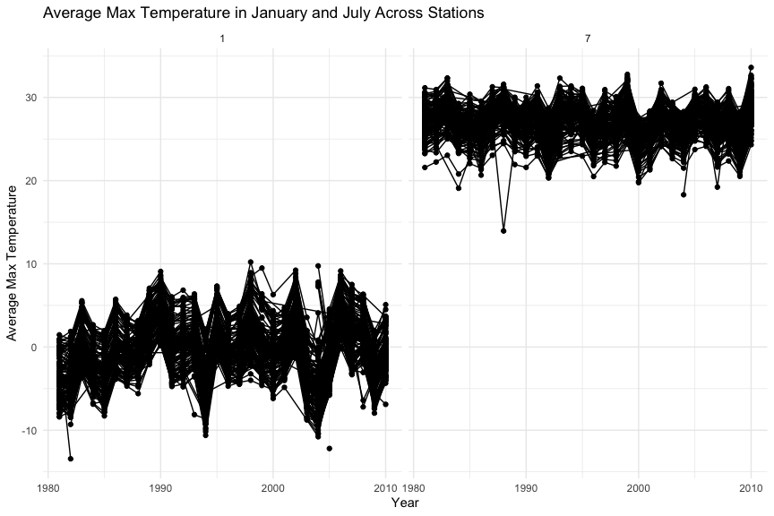
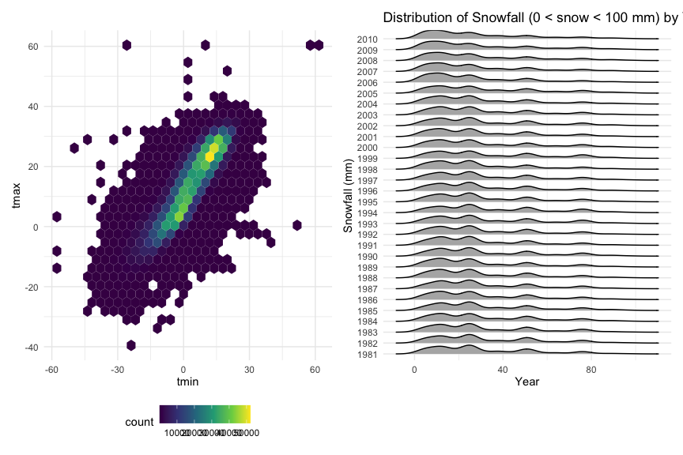

p8105_hw3_fl2715
================
Fengwei Lei

## Loading Library and Settings

``` r
library(tidyverse)
```

    ## ── Attaching core tidyverse packages ──────────────────────── tidyverse 2.0.0 ──
    ## ✔ dplyr     1.1.4     ✔ readr     2.1.5
    ## ✔ forcats   1.0.0     ✔ stringr   1.5.1
    ## ✔ ggplot2   3.5.1     ✔ tibble    3.2.1
    ## ✔ lubridate 1.9.3     ✔ tidyr     1.3.1
    ## ✔ purrr     1.0.2     
    ## ── Conflicts ────────────────────────────────────────── tidyverse_conflicts() ──
    ## ✖ dplyr::filter() masks stats::filter()
    ## ✖ dplyr::lag()    masks stats::lag()
    ## ℹ Use the conflicted package (<http://conflicted.r-lib.org/>) to force all conflicts to become errors

``` r
library(ggridges)
library(patchwork)

knitr::opts_chunk$set(
    echo = TRUE,
    warning = FALSE,
    fig.width = 9, 
  fig.height = 6,
  out.width = "90%"
)

theme_set(theme_minimal() + theme(legend.position = "bottom"))

options(
  ggplot2.continuous.colour = "viridis",
  ggplot2.continuous.fill = "viridis"
)

scale_colour_discrete = scale_colour_viridis_d
scale_fill_discrete = scale_fill_viridis_d
```

## Problem 1

### Loading Dataset

``` r
library(p8105.datasets)
data("ny_noaa")
```

### A Brief Data Discription

``` r
# Summarize missing values
ny_noaa  |> 
  summarize(across(everything(), ~sum(is.na(.))))  |> 
  pivot_longer(cols = everything(), names_to = "variable", values_to = "missing_values")  |> 
  arrange(desc(missing_values))
```

    ## # A tibble: 7 × 2
    ##   variable missing_values
    ##   <chr>             <int>
    ## 1 tmin            1134420
    ## 2 tmax            1134358
    ## 3 snwd             591786
    ## 4 snow             381221
    ## 5 prcp             145838
    ## 6 id                    0
    ## 7 date                  0

The dataset contains daily weather observations from various NOAA
stations in New York, with 2595176 rows and 7 columns. The key variables
include date (date of observation), prcp (precipitation (tenths of mm)),
snow (Snowfall (mm)), snwd (snow depth (mm)), tmax (maximum temperature
(tenths of degrees C)) and tmin (Minimum temperature (tenths of degrees
C)). Missing data is present in the above table, particularly
temperature and precipitation measurements. So we need to deal with
missing values issue first for further analysis.

### Answering Given Questions

#### Data Cleaning

We do some data cleaning process. It begins by converting the date
variable into individual year, month, and day variables using the
`separate()` function. Following this, we convert `tmax` and `tmin` to
numeric.

``` r
ny_noaa_clean = ny_noaa  |> 
  mutate(date = as.character(date)) |> 
  separate(date, into = c("year", "month", "day"), convert=TRUE)  |> 
  mutate(
    tmax = as.numeric(tmax),
    tmin = as.numeric(tmin),
    tmax= tmax /10,
    tmin=tmin/10)
```

After that, we find the most commonly observed values for snowfall.

``` r
ny_noaa_clean  |>
  count(snow)  |> 
  arrange(desc(n))  |> 
  head(10)
```

    ## # A tibble: 10 × 2
    ##     snow       n
    ##    <int>   <int>
    ##  1     0 2008508
    ##  2    NA  381221
    ##  3    25   31022
    ##  4    13   23095
    ##  5    51   18274
    ##  6    76   10173
    ##  7     8    9962
    ##  8     5    9748
    ##  9    38    9197
    ## 10     3    8790

The most commonly observed snowfall value is 0, with 2,008,508
occurrences. This high frequency of zero snowfall indicates that on many
days, no snowfall was recorded. This is common because snowfall occurs
only during specific weather conditions in NY. The second most commonly
observed value is `NA`, showing missing values.

#### Plot for Average Maximum Temperature in January and July

The code creates a two-panel plot showing the average maximum
temperature in January and July across multiple weather stations over
the years. It groups the data by station ID, year, and month, then
calculates the mean maximum temperature (mean_tmax) for January and
July, using `facet_grid(~month)` to display separate panels for each
month. The plot reveals expected seasonal trends: January’s average
temperatures are consistently lower than July’s for all stations and
years. The stations tend to show similar temperature fluctuations across
years, with peaks and valleys aligned. Notably, one station in July 1987
or 1988 shows an unusually low temperature, along with a few other minor
outliers.

``` r
ny_noaa_clean  |> 
  group_by(id, year, month)  |> 
  filter(month %in% c(1, 7), !is.na(tmax))  |> 
  summarize(mean_tmax = mean(tmax, na.rm = TRUE, color = id)) |> 
  ggplot(aes(x = year, y = mean_tmax, group = id)) + geom_point() + geom_path() +
  facet_grid(~month) +
  labs(
    title = "Average Max Temperature in January and July Across Stations",
    x = "Year", y = "Average Max Temperature"
  )
```

    ## `summarise()` has grouped output by 'id', 'year'. You can override using the
    ## `.groups` argument.



#### Two Plots for “tmax vs tmin” and “Snowfall distribution for values \> 0 and \< 100”

``` r
p1 = ny_noaa_clean  |> 
  filter(!is.na(tmax), !is.na(tmin))  |> 
  ggplot(aes(x = tmin, y = tmax)) +
  geom_hex()
  labs(
    title = "tmax vs tmin Plot",
    x = "Minimum Temperature (°C)", y = "Maximum Temperature (°C)"
  )
```

    ## $x
    ## [1] "Minimum Temperature (°C)"
    ## 
    ## $y
    ## [1] "Maximum Temperature (°C)"
    ## 
    ## $title
    ## [1] "tmax vs tmin Plot"
    ## 
    ## attr(,"class")
    ## [1] "labels"

``` r
p2 = ny_noaa_clean  |> 
  filter(snow > 0 & snow < 100)  |> 
  ggplot(aes(x = snow, y = factor(year))) +
  geom_density_ridges(scale = .85)+
  labs(
    title = "Distribution of Snowfall (0 < snow < 100 mm) by Year",
    x = "Year", y = "Snowfall (mm)"
  ) 

p1 + p2
```

    ## Picking joint bandwidth of 3.76



## Problem 2

### Load and Tidy the Data

Firstly, we load the original demographic and accelerometer data
separately. After that, we merge these two dataset, following with some
tidy process. It includes excluding participants less than 21 years of
age and missing demographic data, pivoting the data form to longer form
and encoding data with reasonable variable classes.

``` r
## Load the demographic and accelerometer data
demo_data=read.csv(
  "data/nhanes_covar.csv",skip=4) |> 
  janitor::clean_names()

acceler_data=read.csv(
  "data/nhanes_accel.csv") |> 
  janitor::clean_names()

#merge and tidy the data
data=merge(
  demo_data, acceler_data, by="seqn") |> 
  drop_na() |> 
  filter(age >=21) |> 
  pivot_longer(
    cols=min1:min1440,
    names_to = "time",
    values_to = "mims",
    names_prefix ="min") |> 
 mutate(
    sex = factor(sex, levels = c(1, 2), labels = c("male", "female")),
    education = factor(education, levels = c(1, 2, 3), labels = c("less than high school", "high school equivalent", "more than high school"))
  )
```

### Table: Number of Men and Women in Each Education Category

We produce a reader-friendly table for the number of men and women in
each education category.

``` r
education_sex_table = data  |> 
  group_by(education, sex)  |> 
  summarize(count = n_distinct(seqn))  |> 
  pivot_wider(names_from = sex, values_from = count, values_fill = 0)
```

    ## `summarise()` has grouped output by 'education'. You can override using the
    ## `.groups` argument.

``` r
knitr::kable(education_sex_table, caption = "Number of Men and Women in Each Education Category")
```

| education              | male | female |
|:-----------------------|-----:|-------:|
| less than high school  |   27 |     28 |
| high school equivalent |   35 |     23 |
| more than high school  |   56 |     59 |

Number of Men and Women in Each Education Category

Comments:

The above table presents in the “less than high school” group, there are
slightly more women (28) than men (27), indicating a near balance in
this educational attainment level. In the “high school equivalent”
category, the number of men (35) exceeds that of women (23),
highlighting a gender disparity in this education level. Conversely, in
the “more than high school” category, the numbers for men (56) and women
(59) are closely matched, with women slightly outnumbering men. The data
suggests that while there are some gender imbalances in educational
attainment, particularly at the high school level, the distribution
becomes more equitable at higher education levels.
