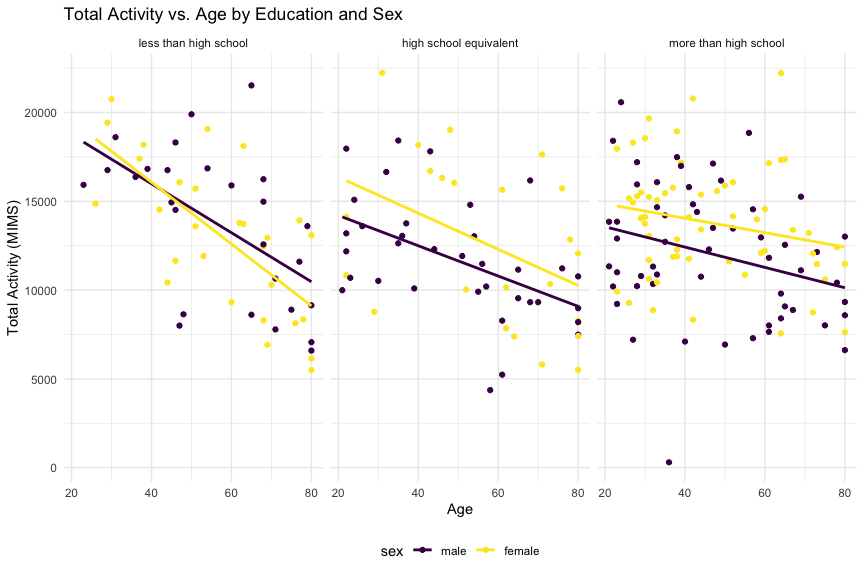

p8105_hw3_fl2715
================
Fengwei Lei

## Loading Library and Settings

``` r
library(tidyverse)
```

    ## ── Attaching core tidyverse packages ──────────────────────── tidyverse 2.0.0 ──
    ## ✔ dplyr     1.1.4     ✔ readr     2.1.5
    ## ✔ forcats   1.0.0     ✔ stringr   1.5.1
    ## ✔ ggplot2   3.5.1     ✔ tibble    3.2.1
    ## ✔ lubridate 1.9.3     ✔ tidyr     1.3.1
    ## ✔ purrr     1.0.2     
    ## ── Conflicts ────────────────────────────────────────── tidyverse_conflicts() ──
    ## ✖ dplyr::filter() masks stats::filter()
    ## ✖ dplyr::lag()    masks stats::lag()
    ## ℹ Use the conflicted package (<http://conflicted.r-lib.org/>) to force all conflicts to become errors

``` r
library(ggridges)
library(patchwork)

knitr::opts_chunk$set(
    echo = TRUE,
    warning = FALSE,
    fig.width = 9, 
  fig.height = 6,
  out.width = "90%"
)

theme_set(theme_minimal() + theme(legend.position = "bottom"))

options(
  ggplot2.continuous.colour = "viridis",
  ggplot2.continuous.fill = "viridis"
)

scale_colour_discrete = scale_colour_viridis_d
scale_fill_discrete = scale_fill_viridis_d
```

## Problem 1

### Loading Dataset

``` r
library(p8105.datasets)
data("ny_noaa")
```

### A Brief Data Discription

``` r
# Summarize missing values
ny_noaa  |> 
  summarize(across(everything(), ~sum(is.na(.))))  |> 
  pivot_longer(cols = everything(), names_to = "variable", values_to = "missing_values")  |> 
  arrange(desc(missing_values))
```

    ## # A tibble: 7 × 2
    ##   variable missing_values
    ##   <chr>             <int>
    ## 1 tmin            1134420
    ## 2 tmax            1134358
    ## 3 snwd             591786
    ## 4 snow             381221
    ## 5 prcp             145838
    ## 6 id                    0
    ## 7 date                  0

The dataset contains daily weather observations from various NOAA
stations in New York, with 2595176 rows and 7 columns. The key variables
include date (date of observation), prcp (precipitation (tenths of mm)),
snow (Snowfall (mm)), snwd (snow depth (mm)), tmax (maximum temperature
(tenths of degrees C)) and tmin (Minimum temperature (tenths of degrees
C)). Missing data is present in the above table, particularly
temperature and precipitation measurements. So we need to deal with
missing values issue first for further analysis.

### Answering Given Questions

#### Data Cleaning

We do some data cleaning process. It begins by converting the date
variable into individual year, month, and day variables using the
`separate()` function. Following this, we convert `tmax` and `tmin` to
numeric.

``` r
ny_noaa_clean = ny_noaa  |> 
  mutate(date = as.character(date)) |> 
  separate(date, into = c("year", "month", "day"), convert=TRUE)  |> 
  mutate(
    tmax = as.numeric(tmax),
    tmin = as.numeric(tmin),
    tmax= tmax /10,
    tmin=tmin/10)
```

After that, we find the most commonly observed values for snowfall.

``` r
ny_noaa_clean  |>
  count(snow)  |> 
  arrange(desc(n))  |> 
  head(10)
```

    ## # A tibble: 10 × 2
    ##     snow       n
    ##    <int>   <int>
    ##  1     0 2008508
    ##  2    NA  381221
    ##  3    25   31022
    ##  4    13   23095
    ##  5    51   18274
    ##  6    76   10173
    ##  7     8    9962
    ##  8     5    9748
    ##  9    38    9197
    ## 10     3    8790

The most commonly observed snowfall value is 0, with 2,008,508
occurrences. This high frequency of zero snowfall indicates that on many
days, no snowfall was recorded. This is common because snowfall occurs
only during specific weather conditions in NY. The second most commonly
observed value is `NA`, showing missing values.

#### Plot for Average Maximum Temperature in January and July

The code creates a two-panel plot showing the average maximum
temperature in January and July across multiple weather stations over
the years. It groups the data by station ID, year, and month, then
calculates the mean maximum temperature (mean_tmax) for January and
July, using `facet_grid(~month)` to display separate panels for each
month. The plot reveals expected seasonal trends: January’s average
temperatures are consistently lower than July’s for all stations and
years. The stations tend to show similar temperature fluctuations across
years, with peaks and valleys aligned. Notably, one station in July 1987
or 1988 shows an unusually low temperature, along with a few other minor
outliers.

``` r
ny_noaa_clean  |> 
  group_by(id, year, month)  |> 
  filter(month %in% c(1, 7), !is.na(tmax))  |> 
  summarize(mean_tmax = mean(tmax, na.rm = TRUE, color = id)) |> 
  ggplot(aes(x = year, y = mean_tmax, group = id)) + geom_point() + geom_path() +
  facet_grid(~month) +
  labs(
    title = "Average Max Temperature in January and July Across Stations",
    x = "Year", y = "Average Max Temperature"
  )
```

    ## `summarise()` has grouped output by 'id', 'year'. You can override using the
    ## `.groups` argument.


#### Two Plots for “tmax vs tmin” and “Snowfall distribution for values \> 0 and \< 100”

``` r
p1 = ny_noaa_clean  |> 
  filter(!is.na(tmax), !is.na(tmin))  |> 
  ggplot(aes(x = tmin, y = tmax)) +
  geom_hex()
  labs(
    title = "tmax vs tmin Plot",
    x = "Minimum Temperature (°C)", y = "Maximum Temperature (°C)"
  )
```

    ## $x
    ## [1] "Minimum Temperature (°C)"
    ## 
    ## $y
    ## [1] "Maximum Temperature (°C)"
    ## 
    ## $title
    ## [1] "tmax vs tmin Plot"
    ## 
    ## attr(,"class")
    ## [1] "labels"

``` r
p2 = ny_noaa_clean  |> 
  filter(snow > 0 & snow < 100)  |> 
  ggplot(aes(x = snow, y = factor(year))) +
  geom_density_ridges(scale = .85)+
  labs(
    title = "Distribution of Snowfall (0 < snow < 100 mm) by Year",
    x = "Year", y = "Snowfall (mm)"
  ) 

p1 + p2
```

    ## Picking joint bandwidth of 3.76


## Problem 2

### Load and Tidy the Data

Firstly, we load the original demographic and accelerometer data
separately. After that, we merge these two dataset, following with some
tidy process. It includes excluding participants less than 21 years of
age and missing demographic data, pivoting the data form to longer form
and encoding data with reasonable variable classes.

``` r
## Load the demographic and accelerometer data
demo_data=read.csv(
  "data/nhanes_covar.csv",skip=4) |> 
  janitor::clean_names()

acceler_data=read.csv(
  "data/nhanes_accel.csv") |> 
  janitor::clean_names()

#merge and tidy the data
data=merge(
  demo_data, acceler_data, by="seqn") |> 
  drop_na() |> 
  filter(age >=21) |> 
  pivot_longer(
    cols=min1:min1440,
    names_to = "time",
    values_to = "mims",
    names_prefix ="min") |> 
 mutate(
    sex = factor(sex, levels = c(1, 2), labels = c("male", "female")),
    education = factor(education, levels = c(1, 2, 3), labels = c("less than high school", "high school equivalent", "more than high school"))
  )
```

### Table: Number of Men and Women in Each Education Category

We produce a reader-friendly table for the number of men and women in
each education category.

``` r
education_sex_table = data  |> 
  group_by(education, sex)  |> 
  summarize(count = n_distinct(seqn))  |> 
  pivot_wider(names_from = sex, values_from = count, values_fill = 0)
```

    ## `summarise()` has grouped output by 'education'. You can override using the
    ## `.groups` argument.

``` r
knitr::kable(education_sex_table)
```

| education              | male | female |
|:-----------------------|-----:|-------:|
| less than high school  |   27 |     28 |
| high school equivalent |   35 |     23 |
| more than high school  |   56 |     59 |

Comments:

The above table presents in the “less than high school” group, there are
slightly more women (28) than men (27), indicating a near balance in
this educational attainment level. In the “high school equivalent”
category, the number of men (35) exceeds that of women (23),
highlighting a gender disparity in this education level. Conversely, in
the “more than high school” category, the numbers for men (56) and women
(59) are closely matched, with women slightly outnumbering men. The data
suggests that while there are some gender imbalances in educational
attainment, particularly at the high school level, the distribution
becomes more equitable at higher education levels.

### Age Distribution Visualization

We create a visualization of the age distributions for men and women in
each education category.

``` r
data_unique = data  |> 
  distinct(seqn, .keep_all = TRUE)

ggplot(data_unique, aes(x = age, fill = sex)) +
  geom_density(alpha = 0.5) +
  facet_grid(~ education) +
  labs(title = "Age Distribution by Education and Sex", x = "Age", y = "Density")
```


Comments:

In all three panels, females (yellow) generally outnumber males (purple)
at older ages for those with higher education or less. Also, for those
with high school equivalent or less education level, the age
distribution of males peaks earlier than females. In the “more than high
school” group, the distributions of male and female both peak at about
age 31, while male dominate at older ages (60+).

### Total Activity vs. Age Plot

We aggregate across minutes to create a total activity variable for each
participant. And we plot these total activities (y-axis) against age
(x-axis), with comparing men to women and having separate panels for
each education level. Also, we include a trend line or a smooth to
illustrate differences.

``` r
total_activity = data  |> 
  group_by(seqn, sex, education, age)  |> 
  summarise(total_mims = sum(mims, na.rm = TRUE))
```

    ## `summarise()` has grouped output by 'seqn', 'sex', 'education'. You can
    ## override using the `.groups` argument.

``` r
# Plot total activity vs. age, comparing men and women, and faceting by education level
ggplot(total_activity, aes(x = age, y = total_mims, color = sex)) +
  geom_point() +
  geom_smooth(method = "lm",se = FALSE) +
  facet_wrap(~ education) +
  labs(title = "Total Activity vs. Age by Education and Sex", x = "Age", y = "Total Activity (MIMS)")
```

    ## `geom_smooth()` using formula = 'y ~ x'



Comments:

In all categories, physical activity declines with age, but the decline
is steeper for female (yellow) especially for those with less than a
high school education. Females (yellow) seem to maintain higher activity
levels later in life, particularly among those with more education.
There is greater variability in total activity among older individuals
in all groups, with distinct linear trends highlighting the sex
differences.

### 24-Hour Activity Time Course Plot

Now we make a three-panel plot that shows the 24-hour activity time
courses for each education level and use color to indicate sex.

``` r
hourly_data = data  |> 
  mutate(hour = as.numeric(time) / 60) |> 
  group_by(education, sex, hour)  |> 
  summarize(mean_mims = mean(mims), .groups = "drop")

ggplot(hourly_data, aes(x = hour, y = mean_mims, color = sex)) +
  geom_point(alpha = .2) + 
  geom_smooth(se = FALSE, aes(group = sex)) +
  facet_wrap(~ education, ncol = 1) +
  labs(title = "24-Hour Activity Time Courses by Education Level and Sex",
       x = "Hour of the Day",
       y = "Mean MIMS",
       color = "Sex")
```

    ## `geom_smooth()` using method = 'gam' and formula = 'y ~ s(x, bs = "cs")'


Conclusion:

This graph presents the average physical activity across a 24-hour
period, divided by education level and sex. Across all education levels,
activity peaks about between 7:00 and 18:00, with males (purple) and
females (yellow) showing similar patterns. However, females consistently
demonstrate higher activity levels throughout the day, especially in the
group with more than a high school education. As expected, the
night-time hours show very low activity. The overall trends suggest that
daily activity follows similar patterns regardless of education level,
but females generally exhibit higher levels of physical activity across
the board.

## Problem 3

### Import, Clean, and Tidy Data

``` r
#Import data
jan_2020_data=read_csv(
  "data/Jan 2020 Citi.csv") |> 
  janitor::clean_names() |> 
  mutate(
    year=2020,
    month="January")
```

    ## Rows: 12420 Columns: 7
    ## ── Column specification ────────────────────────────────────────────────────────
    ## Delimiter: ","
    ## chr (6): ride_id, rideable_type, weekdays, start_station_name, end_station_n...
    ## dbl (1): duration
    ## 
    ## ℹ Use `spec()` to retrieve the full column specification for this data.
    ## ℹ Specify the column types or set `show_col_types = FALSE` to quiet this message.

``` r
july_2020_data=read_csv(
  "data/July 2020 Citi.csv") |> 
  janitor::clean_names() |> 
  mutate(
    year=2020,
    month="July")
```

    ## Rows: 21048 Columns: 7
    ## ── Column specification ────────────────────────────────────────────────────────
    ## Delimiter: ","
    ## chr (6): ride_id, rideable_type, weekdays, start_station_name, end_station_n...
    ## dbl (1): duration
    ## 
    ## ℹ Use `spec()` to retrieve the full column specification for this data.
    ## ℹ Specify the column types or set `show_col_types = FALSE` to quiet this message.

``` r
jan_2024_data=read_csv(
  "data/Jan 2024 Citi.csv") |> 
  janitor::clean_names() |> 
  mutate(
    year=2024,
    month="January")
```

    ## Rows: 18861 Columns: 7
    ## ── Column specification ────────────────────────────────────────────────────────
    ## Delimiter: ","
    ## chr (6): ride_id, rideable_type, weekdays, start_station_name, end_station_n...
    ## dbl (1): duration
    ## 
    ## ℹ Use `spec()` to retrieve the full column specification for this data.
    ## ℹ Specify the column types or set `show_col_types = FALSE` to quiet this message.

``` r
july_2024_data=read_csv(
  "data/July 2024 Citi.csv") |> 
  janitor::clean_names() |> 
  mutate(
    year=2024,
    month="July")
```

    ## Rows: 47156 Columns: 7
    ## ── Column specification ────────────────────────────────────────────────────────
    ## Delimiter: ","
    ## chr (6): ride_id, rideable_type, weekdays, start_station_name, end_station_n...
    ## dbl (1): duration
    ## 
    ## ℹ Use `spec()` to retrieve the full column specification for this data.
    ## ℹ Specify the column types or set `show_col_types = FALSE` to quiet this message.

``` r
# merge the data
combined_data = bind_rows(jan_2020_data, july_2020_data, jan_2024_data, july_2024_data)
```

### Total Number of Rides by Year, Month, and Membership Status

We produce a reader-friendly table showing the total number of rides in
each combination of year and month separating casual riders and Citi
Bike members.

``` r
ride_summary = combined_data  |> 
  group_by(year, month, member_casual)  |> 
  summarize(total_rides = n()) |> 
  pivot_wider(
    names_from = member_casual, 
    values_from = total_rides)
```

    ## `summarise()` has grouped output by 'year', 'month'. You can override using the
    ## `.groups` argument.

``` r
knitr::kable(ride_summary)
```

| year | month   | casual | member |
|-----:|:--------|-------:|-------:|
| 2020 | January |    984 |  11436 |
| 2020 | July    |   5637 |  15411 |
| 2024 | January |   2108 |  16753 |
| 2024 | July    |  10894 |  36262 |

Comment:

The above table shows both casual and member rides increased
significantly from 2020 to 2024. Member rides, in particular, saw a
marked rise, especially in July 2024, with over 36,000 rides compared to
about 15,000 in July 2020. Casual rides also increased, though the
growth was more moderate, with a notable spike in July 2024. This
suggests growing overall usage of Citi Bike, especially among members.

### Top 5 Most Popular Starting Stations for July 2024

Now we make a table showing the 5 most popular starting stations for
July 2024; include the number of rides originating from these stations.

``` r
top_stations_july_2024 = july_2024_data  |> 
  group_by(start_station_name)  |> 
  summarize(num_rides = n())  |> 
  arrange(desc(num_rides))  |> 
  head(5)

knitr::kable(top_stations_july_2024)
```

| start_station_name       | num_rides |
|:-------------------------|----------:|
| Pier 61 at Chelsea Piers |       163 |
| University Pl & E 14 St  |       155 |
| W 21 St & 6 Ave          |       152 |
| West St & Chambers St    |       150 |
| W 31 St & 7 Ave          |       146 |

### Effects of Day, Month, and Year on Median Ride Duration

We make a plot to investigate the effects of day of the week, month, and
year on median ride duration.

``` r
ride_duration_summary = combined_data  |> 
  group_by(year, month, weekdays)  |> 
  summarize(median_duration = median(duration)) |> 
  mutate(
  weekdays=factor(weekdays, levels = c("Monday", "Tuesday", "Wednesday", "Thursday", "Friday", "Saturday", "Sunday")))
```

    ## `summarise()` has grouped output by 'year', 'month'. You can override using the
    ## `.groups` argument.

``` r
ggplot(ride_duration_summary, aes(x = weekdays, y = median_duration, color = factor(year))) +
  geom_line(aes(group = year),size=1) +
  facet_grid(~ month) +
  labs(title = "Effects of Day, Month, and Year on Median Ride Duration",
       x = "Weekdays", y = "Median Ride Duration", color = "Year")
```


Comment:

The plot compares the median ride duration by weekday for January and
July in 2020 and 2024.

January: Median ride durations in 2020 (purple line) are consistently
longer than in 2024 (yellow line). Duration peaked slightly towards
Friday and Sunday in 2020, while 2024 showed a more stable and shorter
duration trend with minimal fluctuations across the weekdays.

July: Both years show longer median ride duration compared to January.
In 2020, there was a notable increase in duration toward the weekend,
with Sunday having the longest rides. In 2024, the ride duration also
increased towards the weekend, but they remain noticeably shorter than
in 2020.

### Impact of Month, Membership Status, and Bike Type on Ride Duration in 2024

Finally, we make a figure that shows the impact of month, membership
status, and bike type on the distribution of ride duration for data in
2024.

``` r
data_2024 = combined_data  |> 
  filter(year == 2024)

ggplot(data_2024, aes(x = duration, fill = member_casual)) +
  geom_density(alpha = 0.5) +
  facet_grid(rideable_type ~ month) +
  labs(title = "Impact of Month, Membership Status, and Bike Type on Ride Duration (2024)",
       x = "Ride Duration", y = "Density", fill = "Membership Status")
```


Comment:

The plot illustrates the distribution of ride duration, categorized by
bike type (classic vs. electric), membership status (casual vs. member),
and month (January vs. July) for 2024. Across both months and bike
types, casual users (in purple) tend to have longer ride duration
compared to members (in yellow), who generally have shorter, more
consistent rides. Ride duration is highly concentrated at lower times
(0–20) for all groups, but the density for casual riders is more spread
out with longer tails, particularly for electric bikes. Additionally,
ride duration patterns seem to remain fairly similar between January and
July for electric bikes, while with minor shifts in density for classic
bikes.
